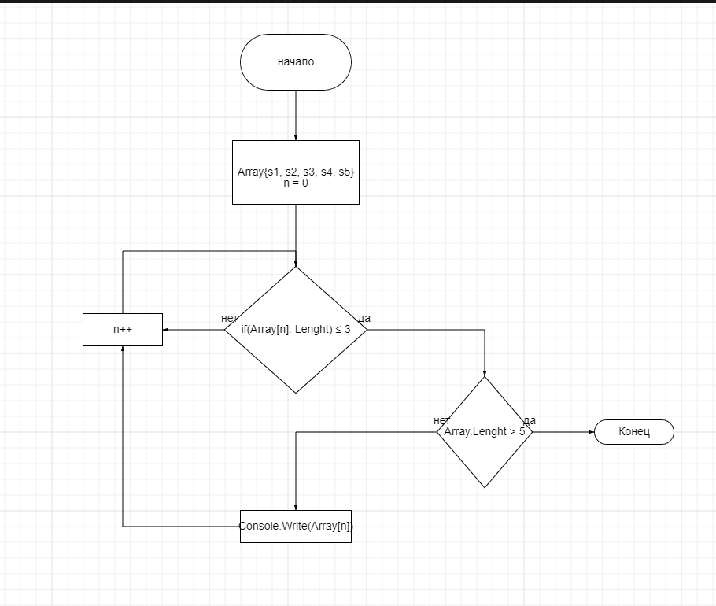

# Здесь будет показано решение к итоговому заданию первого блока по образовательной программе Разработчик

## Первым этапом было создание репеозитория на сайте GitHub, в которым вы на данный момент находитесь

## Вторым этапом следовало нарисовать блок схему

## Затем создания файла README.md

## Далее написание самой програмы, что решают поставленную задачу

Написать программу, которая из имеющегося массива строк фщрмирует массив из строк, длина которых меньше либо равна 3-м символам

## И, соответсвенно, использовать контроль версии, не забывая при этом производить коммиты. Желательно оставляя несколько
